# Website Builder Architecture Breakdown

> Based on the Web Prodigies Plura tutorial — complete architecture documentation

---

## 1. Editor Overview

The editor is a full-screen page builder that uses **no external packages for drag and drop** — only native HTML5 Drag and Drop API.

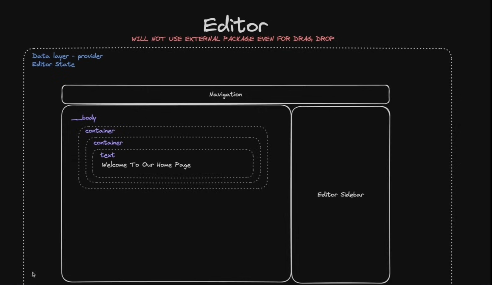

### Layout Structure

```
┌─────────────────────────────────────────────────────────────┐
│  Data Layer — EditorProvider (React Context)                 │
│  Editor State (wraps everything)                             │
│                                                              │
│  ┌─────────────────────────────────────────────────────────┐ │
│  │                    Navigation (Toolbar)                   │ │
│  │  Device toggle | Undo/Redo | Preview | Save              │ │
│  ├──────────────────────────────┬──────────────────────────┤ │
│  │                              │                          │ │
│  │         __body               │     Editor Sidebar       │ │
│  │         (Canvas)             │                          │ │
│  │                              │     - Components tab     │ │
│  │    ┌─ container ──────────┐  │     - Settings tab       │ │
│  │    │  ┌─ container ─────┐ │  │     - Media tab          │ │
│  │    │  │  text           │ │  │                          │ │
│  │    │  │  "Welcome..."   │ │  │                          │ │
│  │    │  └─────────────────┘ │  │                          │ │
│  │    └──────────────────────┘  │                          │ │
│  │                              │                          │ │
│  └──────────────────────────────┴──────────────────────────┘ │
└─────────────────────────────────────────────────────────────┘
```

### Key Principles
- No external drag-and-drop libraries (native HTML5 API only)
- EditorProvider wraps the entire editor (React Context + useReducer)
- All state flows through the provider
- Canvas renders elements recursively
- Sidebar on the right contains components and properties

---

## 2. Types of Elements

There are exactly **two categories** of elements in the builder:

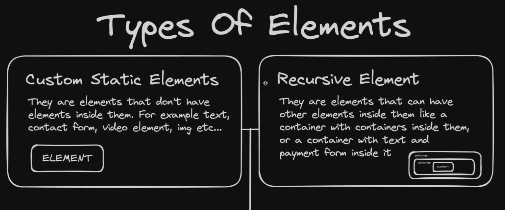

### Custom Static Elements (Leaf Nodes)

Elements that **don't have elements inside them**. They are terminal/leaf nodes in the tree.

```
┌──────────────────────────────────┐
│  Custom Static Elements          │
│                                  │
│  Cannot contain children.        │
│  Examples:                       │
│  - text                          │
│  - contact form                  │
│  - video element                 │
│  - image                         │
│  - link                          │
│  - payment form (checkout)       │
│                                  │
│  ┌──────────┐                    │
│  │ ELEMENT  │  ← standalone      │
│  └──────────┘                    │
└──────────────────────────────────┘
```

### Recursive Elements (Container Nodes)

Elements that **can have other elements inside them**. They create the nesting structure.

```
┌──────────────────────────────────┐
│  Recursive Elements              │
│                                  │
│  Can contain children.           │
│  Examples:                       │
│  - container                     │
│  - section                       │
│  - 2Col (two columns)            │
│  - 3Col (three columns)          │
│  - __body (root element)         │
│                                  │
│  ┌─ container ─────────────────┐ │
│  │  ┌─ container ────────────┐ │ │
│  │  │  ┌──────────┐         │ │ │
│  │  │  │ ELEMENT  │         │ │ │
│  │  │  └──────────┘         │ │ │
│  │  └────────────────────────┘ │ │
│  └─────────────────────────────┘ │
└──────────────────────────────────┘
```

---

## 3. Master Recursive Element

The **Master Recursive Element** is the single wrapper component that decides which element to render based on the element's `type` property.

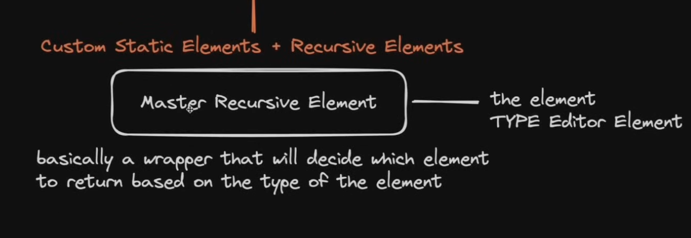

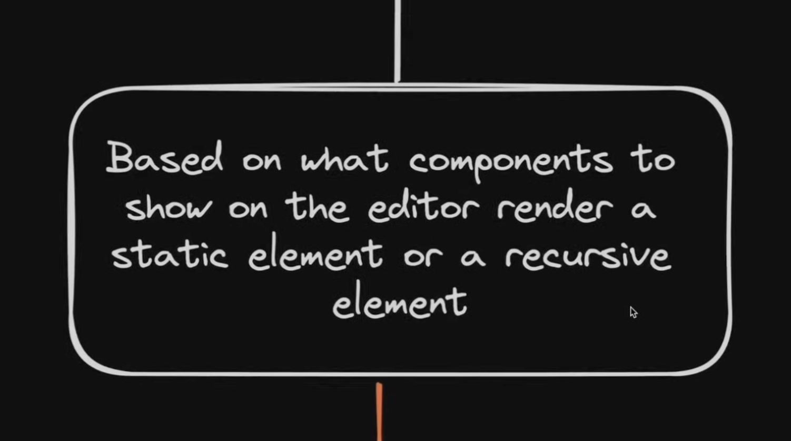

```
Custom Static Elements + Recursive Elements
                    │
                    ▼
        ┌───────────────────────┐
        │ Master Recursive      │──── the element
        │ Element               │     TYPE EditorElement
        └───────────────────────┘
                    │
    "basically a wrapper that will
     decide which element to return
     based on the type of the element"
```

### How it works:

```typescript
// The Recursive component (Master Recursive Element)
function Recursive({ element }: { element: EditorElement }) {
  switch (element.type) {
    case 'text':        return <TextComponent element={element} />
    case 'container':   return <Container element={element} />
    case '__body':      return <Container element={element} />
    case '2Col':        return <Container element={element} />
    case '3Col':        return <Container element={element} />
    case 'video':       return <VideoComponent element={element} />
    case 'link':        return <LinkComponent element={element} />
    case 'contactForm': return <ContactFormComponent element={element} />
    case 'paymentForm': return <Checkout element={element} />
    default:            return null
  }
}

// Container calls Recursive for each child (recursion):
function Container({ element }: { element: EditorElement }) {
  return (
    <div style={element.styles}>
      {element.content.map(child => (
        <Recursive key={child.id} element={child} />
      ))}
    </div>
  )
}
```

### Decision Flow:

```
Recursive receives element
    │
    ├── type === "text"?        → render TextComponent (STATIC)
    ├── type === "video"?       → render VideoComponent (STATIC)
    ├── type === "link"?        → render LinkComponent (STATIC)
    ├── type === "contactForm"? → render ContactForm (STATIC)
    ├── type === "paymentForm"? → render Checkout (STATIC)
    │
    └── type === "container" | "__body" | "2Col" | "3Col"?
        → render Container (RECURSIVE)
        → Container maps over content[]
        → calls Recursive for each child
        → RECURSION continues until leaf nodes
```

---

## 4. EditorElement Data Model

Every element in the builder shares the same base structure:

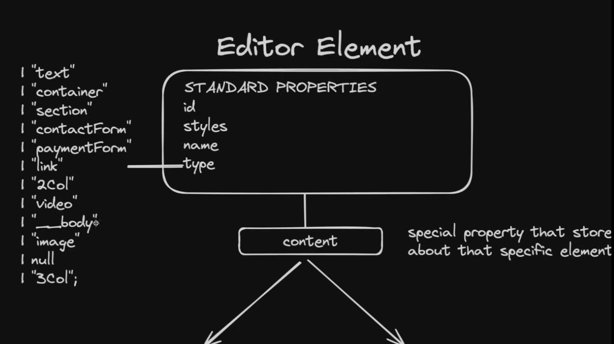

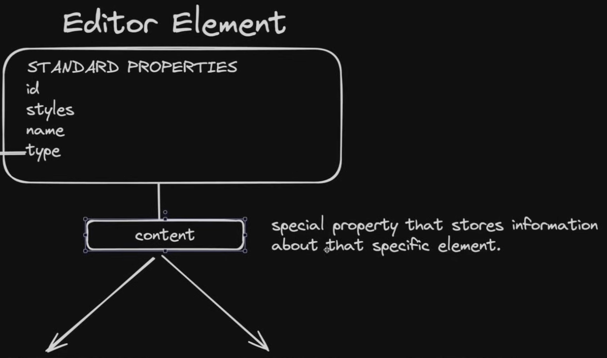

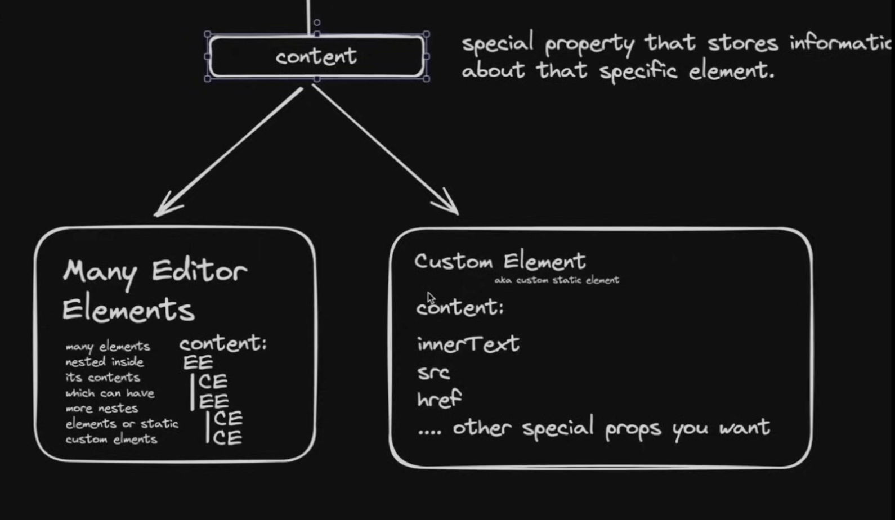

### Standard Properties

```typescript
type EditorElement = {
  id: string;                    // unique identifier (uuid v4)
  styles: React.CSSProperties;  // inline CSS styles
  name: string;                  // display name
  type: EditorBtns;             // element type (see union below)
  content: ???;                  // SPECIAL — branches into two shapes
}
```

### Type Union (all possible element types)

```typescript
type EditorBtns =
  | "text"
  | "container"
  | "section"
  | "contactForm"
  | "paymentForm"
  | "link"
  | "2Col"
  | "video"
  | "__body"
  | "image"
  | null
  | "3Col";
```

### The Content Property (the key design decision)

`content` is a **special property that stores information about that specific element**. It branches into two possible shapes:

```
                    content
                   ╱       ╲
                  ╱         ╲
                 ╱           ╲
    ┌────────────────┐  ┌────────────────────┐
    │ Many Editor    │  │ Custom Element     │
    │ Elements       │  │ (static element)   │
    │                │  │                    │
    │ content:       │  │ content:           │
    │   EE           │  │   innerText        │
    │   CE           │  │   src              │
    │   EE           │  │   href             │
    │   CE           │  │   .... other       │
    │   CE           │  │   special props    │
    │                │  │                    │
    │ "many elements │  │ "key-value pairs   │
    │  nested inside │  │  specific to that  │
    │  which can     │  │  element type"     │
    │  have more     │  │                    │
    │  nested        │  │                    │
    │  elements or   │  │                    │
    │  static custom │  │                    │
    │  elements"     │  │                    │
    └────────────────┘  └────────────────────┘
```

### TypeScript Type Definition

```typescript
type EditorElement = {
  id: string;
  styles: React.CSSProperties;
  name: string;
  type: EditorBtns;
  content:
    | EditorElement[]              // Recursive: array of child elements
    | { href?: string;             // Static: key-value content props
        innerText?: string;
        src?: string;
        [key: string]: string | undefined;
      };
}
```

---

## 5. Concrete Examples

### Example: Custom (Static) Element — Video

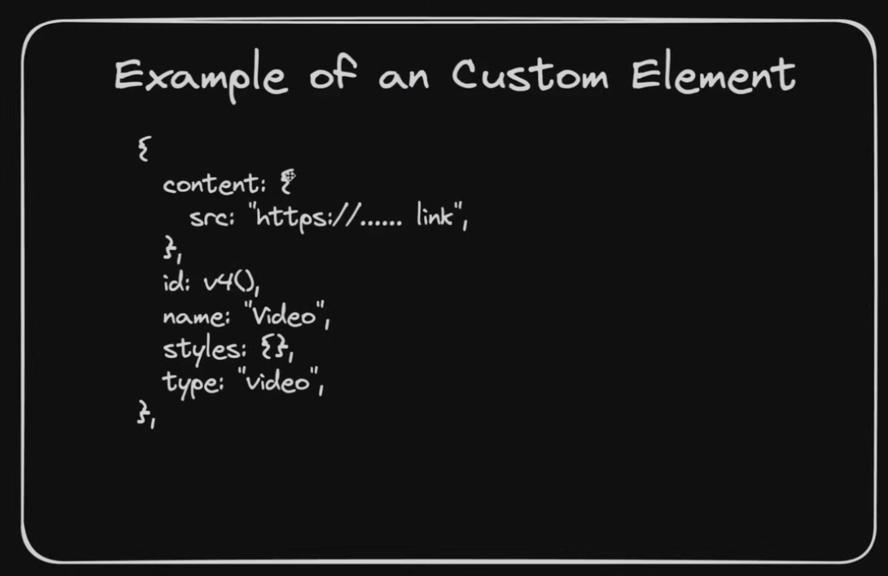

```typescript
{
  content: {
    src: "https://youtube.com/embed/...",   // ← Record<string, string>
  },
  id: v4(),
  name: "Video",
  styles: {},
  type: "video",
}
```

- `content` is an **object** with `src` property
- No children — this is a leaf node
- The renderer reads `content.src` and renders an `<iframe>`

### Example: Editor (Recursive) Element — Two Columns

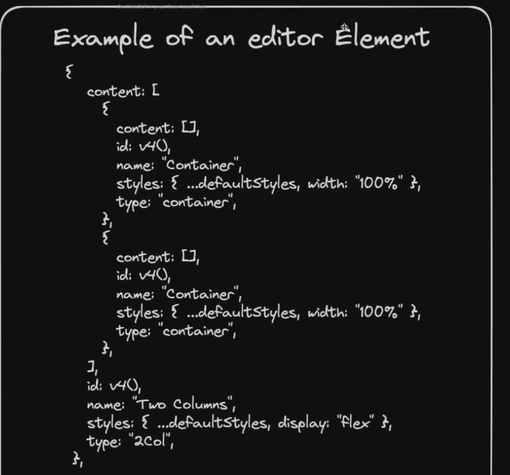

```typescript
{
  content: [                                    // ← EditorElement[] array
    {
      content: [],                              // empty container (drop target)
      id: v4(),
      name: "Container",
      styles: { ...defaultStyles, width: "100%" },
      type: "container",
    },
    {
      content: [],                              // second empty container
      id: v4(),
      name: "Container",
      styles: { ...defaultStyles, width: "100%" },
      type: "container",
    },
  ],
  id: v4(),
  name: "Two Columns",
  styles: { ...defaultStyles, display: "flex" },
  type: "2Col",
}
```

- `content` is an **array** of two child containers
- Each child container has `content: []` (empty, ready for drops)
- The renderer maps over `content` and calls `Recursive` for each child
- `display: "flex"` on the parent creates the side-by-side layout

---

## 6. Editor State Management

The editor uses **React Context + useReducer** for state management.

### State Shape

```typescript
type EditorState = {
  liveMode: boolean;              // live preview (no editor chrome)
  elements: EditorElement[];      // the page element tree [__body]
  selectedElement: EditorElement;  // currently selected element
  device: "Desktop" | "Tablet" | "Mobile";
  previewMode: boolean;           // preview toggle
  funnelPageId: string;           // current page being edited
}
```

### Reducer Actions

```typescript
type EditorAction =
  | { type: "ADD_ELEMENT";            payload: { containerId: string; element: EditorElement } }
  | { type: "UPDATE_ELEMENT";         payload: { element: EditorElement } }
  | { type: "DELETE_ELEMENT";         payload: { elementId: string } }
  | { type: "CHANGE_CLICKED_ELEMENT"; payload: { element: EditorElement } }
  | { type: "CHANGE_DEVICE";          payload: { device: DeviceType } }
  | { type: "TOGGLE_PREVIEW_MODE" }
  | { type: "TOGGLE_LIVE_MODE" }
  | { type: "REDO" }
  | { type: "UNDO" }
  | { type: "LOAD_DATA";             payload: { elements: EditorElement[]; withLive: boolean } }
```

### Provider Pattern

```typescript
// EditorProvider wraps the entire editor
const EditorContext = React.createContext<{
  state: EditorState;
  dispatch: React.Dispatch<EditorAction>;
  subaccountId: string;
  funnelId: string;
  pageDetails: FunnelPage;
}>(...);

// Any child component can access state:
const { state, dispatch } = useEditor();
```

---

## 7. History Stack (Undo/Redo)

The editor maintains a **history stack** — an array of complete editor state snapshots with a pointer to the current position.

### Initial State — History Stack [3]

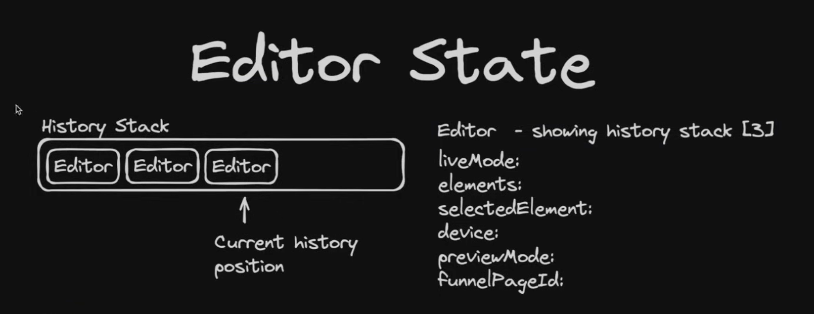

```
History: [Editor₁] [Editor₂] [Editor₃]
                              ↑
                    Current position
```

3 snapshots. Pointer at the end (latest state).

### Add an Element — History Stack [4]

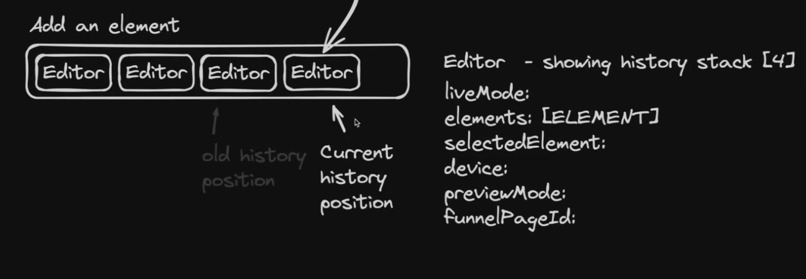

```
History: [Editor₁] [Editor₂] [Editor₃] [Editor₄]
                                         ↑
                              Current position (new)
```

Every mutation (add, update, delete) pushes a new snapshot. Pointer moves forward.

### Undo — History Stack [2]

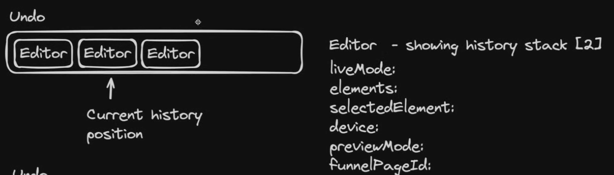

```
History: [Editor₁] [Editor₂] [Editor₃]
                    ↑
          Current position (moved back)
```

Undo moves the pointer **back by 1**. Loads the previous state. The stack stays intact — Editor₃ is still there for redo.

### Redo — History Stack [3]

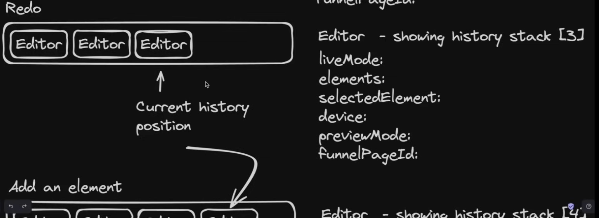

```
History: [Editor₁] [Editor₂] [Editor₃]
                              ↑
                    Current position (moved forward)
```

Redo moves the pointer **forward by 1**. Loads the next state.

### Branching (Add after Undo)

If you undo to position [2] then add a new element, the history **truncates** everything after position [2] and creates a new branch:

```
Before: [Editor₁] [Editor₂] [Editor₃]  ← Editor₃ discarded
After:  [Editor₁] [Editor₂] [Editor₄]  ← new branch from [2]
                              ↑
```

### Implementation

```typescript
// Inside the reducer:
case 'UNDO':
  if (state.history.currentIndex > 0) {
    const prevIndex = state.history.currentIndex - 1;
    const prevState = state.history.history[prevIndex];
    return { ...state, editor: prevState, history: { ...state.history, currentIndex: prevIndex } };
  }
  return state;

case 'REDO':
  if (state.history.currentIndex < state.history.history.length - 1) {
    const nextIndex = state.history.currentIndex + 1;
    const nextState = state.history.history[nextIndex];
    return { ...state, editor: nextState, history: { ...state.history, currentIndex: nextIndex } };
  }
  return state;
```

---

## 8. File Structure (Tutorial)

```
app/(main)/sub-account/[id]/funnels/[funnelId]/editor/[funnelPageId]/
├── page.tsx                    ← Server component (fetches page data)
│
components/editor/
├── editor-provider.tsx         ← EditorContext + useReducer + Provider
├── editor-navigation.tsx       ← Toolbar (device, undo/redo, save, preview)
├── editor-sidebar/
│   ├── index.tsx               ← Sidebar wrapper with tabs
│   ├── tabs/
│   │   ├── components-tab.tsx  ← Draggable component list
│   │   ├── settings-tab.tsx    ← CSS property editor (accordion groups)
│   │   └── media-tab.tsx       ← Media bucket browser
│   └── sidebar-element.tsx     ← Individual draggable component card
├── editor.tsx                  ← Main editor layout (assembles all parts)
├── recursive.tsx               ← Master Recursive Element (the renderer)
├── editor-components/
│   ├── text.tsx                ← Text element component
│   ├── container.tsx           ← Container element component
│   ├── video.tsx               ← Video element component
│   ├── link-component.tsx      ← Link element component
│   ├── contact-form.tsx        ← Contact form component
│   └── checkout.tsx            ← Payment/checkout component
```

---

## 9. Data Flow

```
┌──────────┐     ┌──────────────┐     ┌──────────────┐
│ Database │────▶│ EditorProvider│────▶│   Recursive   │
│ (JSON)   │     │ (state)      │     │  (renderer)   │
└──────────┘     └──────┬───────┘     └──────────────┘
                        │
           ┌────────────┼────────────┐
           ▼            ▼            ▼
     ┌──────────┐ ┌──────────┐ ┌──────────┐
     │Navigation│ │  Canvas  │ │ Sidebar  │
     │(toolbar) │ │ (__body) │ │(tabs)    │
     └──────────┘ └──────────┘ └──────────┘
           │            │            │
           ▼            ▼            ▼
      dispatch()   dispatch()   dispatch()
           │            │            │
           └────────────┼────────────┘
                        ▼
                   useReducer
                   (updates state)
                        │
                        ▼
                   Re-render all
                   subscribed components
```

### Save Flow
1. User clicks Save in toolbar
2. `elements` state is serialized to JSON string
3. `upsertFunnelPage({ content: JSON.stringify(elements) })` saves to DB
4. Page content stored as JSON text in `FunnelPage.content` column

### Load Flow
1. Server component fetches `FunnelPage` from DB
2. Passes `content` string to EditorProvider
3. Provider dispatches `LOAD_DATA` action
4. Reducer parses JSON and sets `elements` state
5. Recursive renderer renders the tree

---

## 10. Drag and Drop (Native HTML5)

No external libraries. Uses native browser APIs:

### Drag from Sidebar (add new element)
```typescript
// Sidebar component card
<div
  draggable
  onDragStart={(e) => {
    e.dataTransfer.setData("componentType", "text");
  }}
>
  Text
</div>
```

### Drop on Canvas (receive element)
```typescript
// Container element
<div
  onDragOver={(e) => {
    e.preventDefault();  // allow drop
  }}
  onDrop={(e) => {
    e.stopPropagation();
    const type = e.dataTransfer.getData("componentType");
    if (type) {
      dispatch({
        type: "ADD_ELEMENT",
        payload: { containerId: element.id, element: createNewElement(type) }
      });
    }
  }}
>
  {children}
</div>
```

### Key behaviors:
- Only **recursive elements** (containers) accept drops
- `e.stopPropagation()` prevents parent containers from also receiving the drop
- `e.preventDefault()` on `dragOver` is required to allow dropping
- Element type is passed via `dataTransfer.setData/getData`

---

## 11. Element Rendering Rules

Each element wraps in a div that handles:
- **Click** → select element (`CHANGE_CLICKED_ELEMENT`)
- **DragOver** → show drop indicator (containers only)
- **Drop** → add element (containers only)
- **Style** → apply `element.styles` as inline CSS
- **Selection outline** → blue border when selected
- **Hover outline** → dashed border on hover
- **Badge** → show element name when selected
- **Delete button** → trash icon on selected element

```typescript
// Every element renders inside this wrapper:
<div
  style={element.styles}
  onClick={(e) => { e.stopPropagation(); dispatch(CHANGE_CLICKED_ELEMENT) }}
  onDragOver={handleDragOver}
  onDrop={handleDrop}
  className={clsx(
    { 'border-blue-500 border-2': isSelected },
    { 'border-dashed border-slate-400': isHovered }
  )}
>
  {/* Element-specific content */}
  {isSelected && <Badge>{element.name}</Badge>}
  {isSelected && <DeleteButton />}
</div>
```

---

## 12. Live/Preview Modes

### Preview Mode
- Hides sidebar and toolbar
- Removes selection outlines and hover effects
- Shows "Exit Preview" button
- Elements are not clickable/draggable
- Triggered by Eye icon in toolbar

### Live Mode
- Same as preview but also hides the exit button
- Used for the actual published page rendering
- Triggered by `TOGGLE_LIVE_MODE` action
- The `[domain]` route renders in permanent live mode

---

*Document generated from Web Prodigies Plura tutorial architecture breakdown diagrams*
